# Filtro de Bloom: demostración en C++ y Manim

Demostración académica de un filtro de Bloom implementado desde cero. El video
tiene texto explicativo en pantalla y no incluye voz en off.

El filtro se implementa en C++17 y se ejecuta realmente: cada operación produce un
registro en `trace.json`, y la animación de Manim reproduce ese registro. No hay
valores escritos a mano en la animación ni en la tabla de este documento. La
animación no calcula hashes ni consulta bits; únicamente dibuja lo que el programa
en C++ ya ejecutó.

No requiere LaTeX: el texto se dibuja con Pango a través de la fuente DejaVu Sans.

- Video: **14 capítulos, 4 minutos y 15 segundos** (255 s).
- Calidad por defecto: **1280 × 720, 30 fps**.
- Dependencia de Python: `manim==0.19.0`.

## Archivos del proyecto

| Archivo | Función |
| --- | --- |
| `bloom.cpp` | Implementa el filtro, ejecuta la secuencia de operaciones y escribe `trace.json`. |
| `bloom_prueba.cpp` | Programa de prueba independiente. Imprime el comportamiento del filtro por consola. **No participa en la generación del video.** |
| `trace.json` | Registro de operaciones producido por `bloom.cpp`. Es la única fuente de datos de la animación. |
| `bloom_animation.py` | Escena de Manim con los 14 capítulos. Lee `trace.json` y lo dibuja. |
| `render.py` | Orquesta el proceso completo: compilar C++, generar el registro y renderizar el video. |
| `chapters.json` | Tiempos de inicio de cada capítulo. Se regenera en cada renderizado. |
| `requirements.txt` | Versión de Manim requerida. |
| `docs/` | Fotogramas del video usados en la galería de este README. |

El video final se entrega como `bloom_completo.mp4`, por separado del código.

## Capturas del video

Un fotograma de cada capítulo, extraído del video renderizado.

| | |
| --- | --- |
| 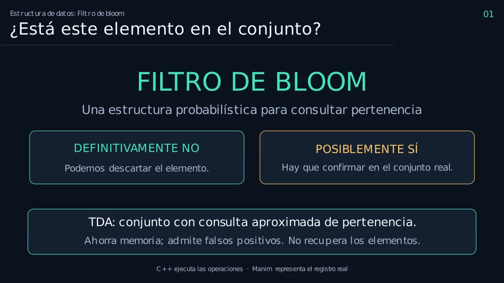 | 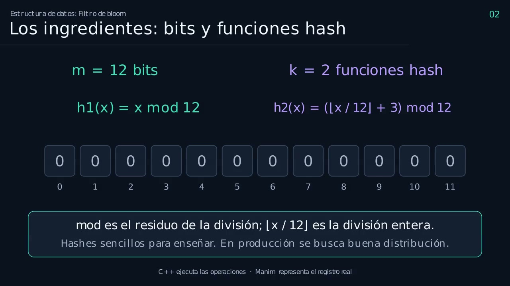 |
| **01 · Presentación.** Las dos respuestas que permite un filtro de Bloom. | **02 · Los ingredientes.** Los 12 bits y las fórmulas de los hashes. |
| 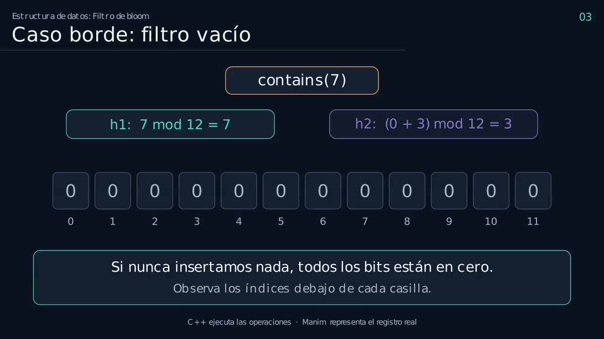 | 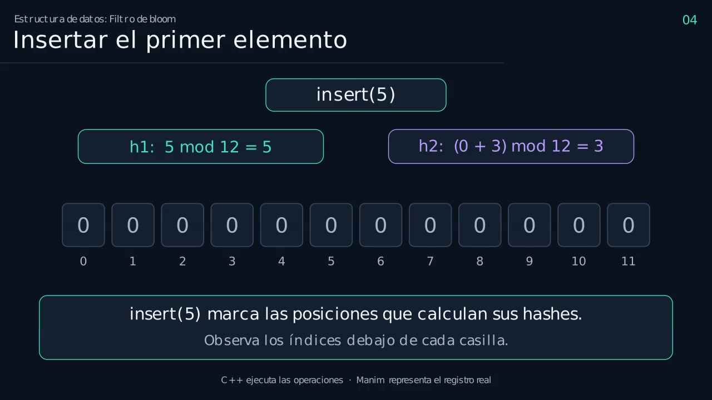 |
| **03 · Filtro vacío.** Una consulta negativa sobre un filtro sin marcas. | **04 · Primera inserción.** `insert(5)` marca las posiciones 5 y 3. |
| 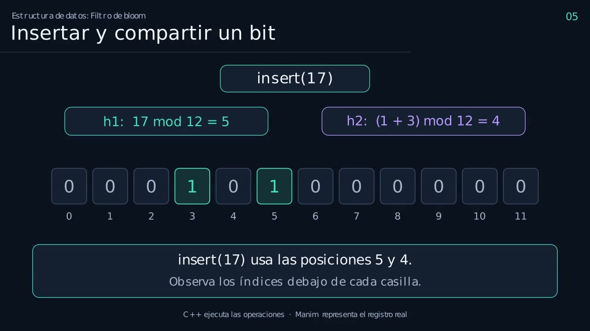 | 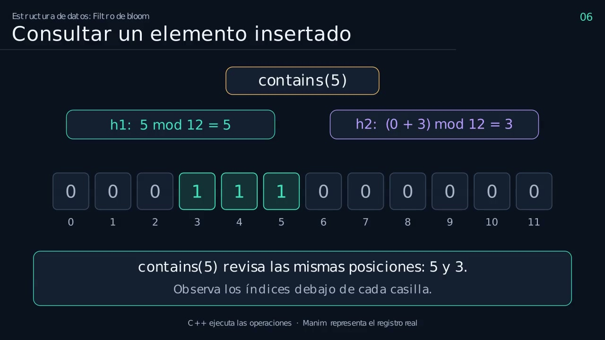 |
| **05 · Bit compartido.** `insert(17)` vuelve a pedir la posición 5. | **06 · Presencia posible.** `contains(5)` encuentra ambos bits en 1. |
| 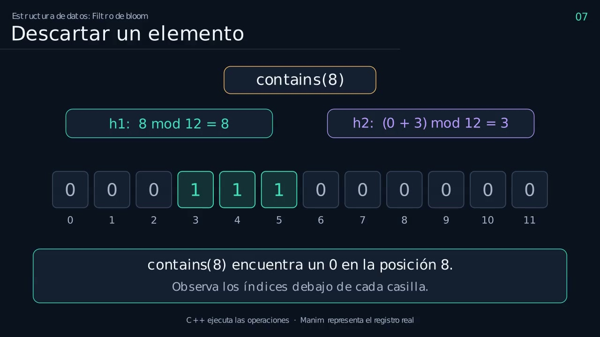 | 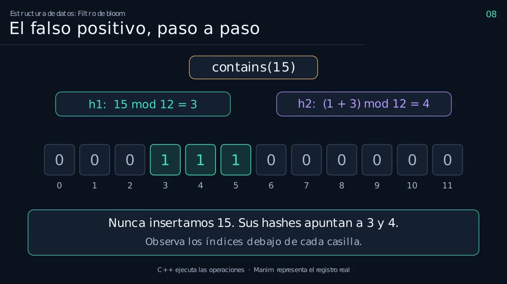 |
| **07 · Ausencia confirmada.** `contains(8)` topa con un 0 y sale temprano. | **08 · Falso positivo.** `contains(15)` da `true` sin haberlo insertado. |
| 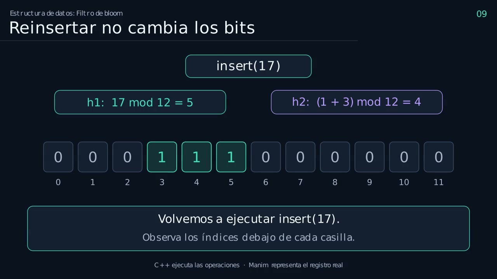 | 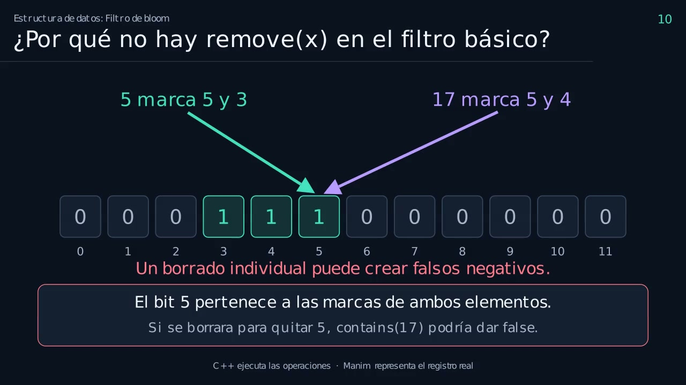 |
| **09 · Reinserción.** Poner un 1 sobre otro 1 no añade información. | **10 · Sin `remove(x)`.** Borrar un bit compartido crearía falsos negativos. |
| 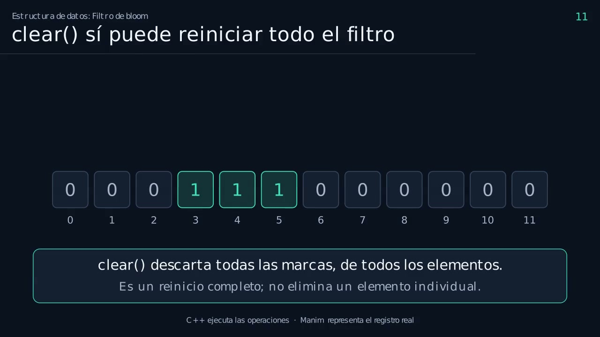 | 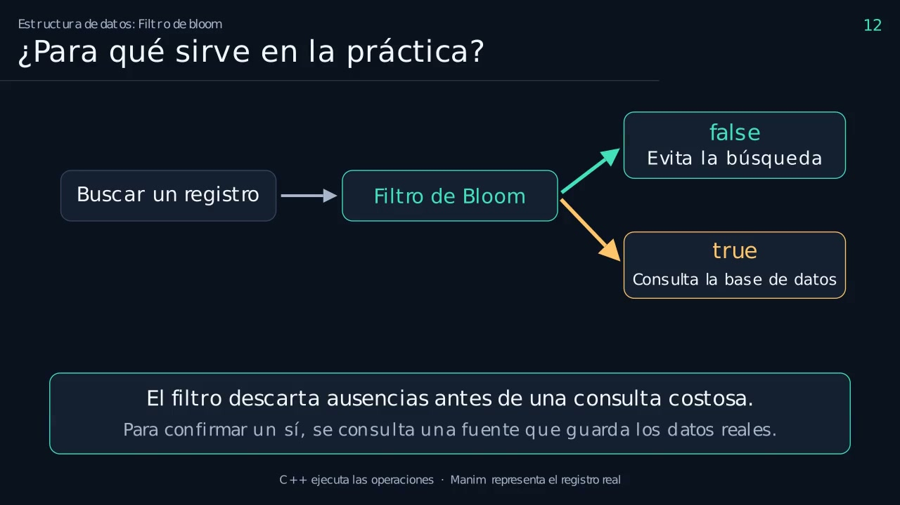 |
| **11 · `clear()`.** Reinicio completo de las 12 posiciones. | **12 · Aplicación.** El filtro evita la consulta costosa. |
| 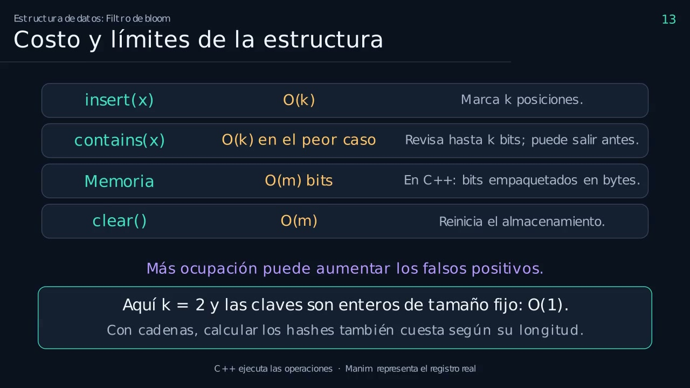 | 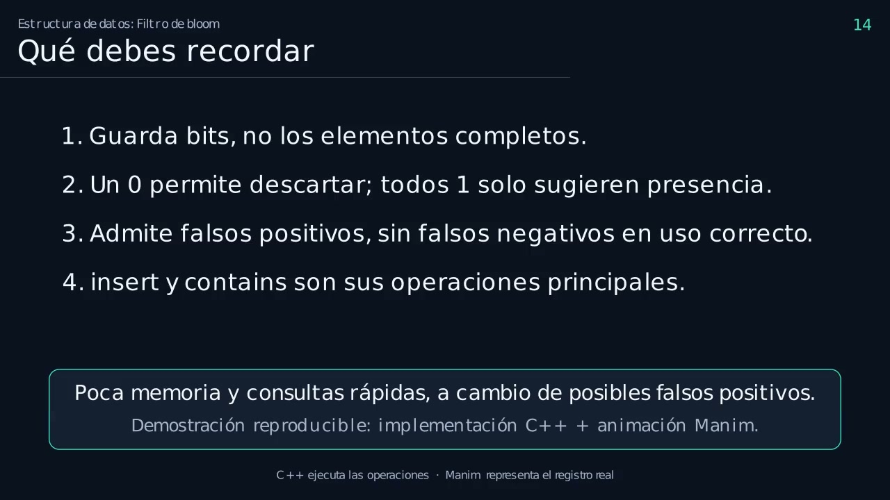 |
| **13 · Costo y límites.** O(k) por operación y efecto de la ocupación. | **14 · Síntesis.** Las cuatro ideas que hay que recordar. |

Las imágenes están en la carpeta `docs/` y se regeneran con el comando indicado en
la sección siguiente.

## Cómo ejecutar

### Requisito previo: el compilador

Se necesita `g++` con soporte de C++17 disponible en el `PATH`. El script
`render.py` busca `g++` y, si no lo encuentra, termina con un mensaje de error.
Para usar otro compilador, define la variable de entorno `CXX`:

```powershell
$env:CXX = "clang++"
```

### Ejecución completa

El proceso es siempre el mismo y en este orden:

1. `render.py` compila `bloom.cpp` y produce `build\bloom.exe`.
2. Ejecuta ese programa, que **es el paso que genera `trace.json`**.
3. Invoca Manim, que lee `trace.json` y dibuja la animación.
4. Copia el resultado a `bloom_completo.mp4`.

En Windows, desde PowerShell y dentro de esta carpeta:

```powershell
py -3.11 -m venv .venv
.\.venv\Scripts\python.exe -m pip install -r requirements.txt
.\.venv\Scripts\python.exe render.py
```

En Linux o macOS:

```bash
python3 -m venv .venv
.venv/bin/python -m pip install -r requirements.txt
.venv/bin/python render.py
```

No es necesario activar el entorno virtual, porque los comandos invocan
directamente el ejecutable de Python que contiene.

**Ejecuta siempre `render.py` desde esta carpeta.** El programa de C++ escribe el
registro en el directorio de trabajo del proceso y no en la ruta que se le pasa
como argumento. Si el comando se lanza desde otro directorio, el registro se
escribe en ese otro lugar y la animación no lo encuentra.

Si alguna dependencia de sistema de Manim falta, consulta la
[instalación oficial de Manim](https://docs.manim.community/en/stable/installation.html).

### Verificar solo la parte de C++

```powershell
.\.venv\Scripts\python.exe render.py --check-only
```

Compila el programa y genera `trace.json`, sin lanzar Manim. Es la forma rápida de
comprobar que la implementación funciona.

### Calidades disponibles

```bash
python render.py --quality l    # 480p15, vista previa rápida
python render.py --quality m    # 720p30, valor por defecto
python render.py --quality h    # 1080p60
```

El tiempo de renderizado depende del equipo. Una pasada de control de toda la
animación ejecuta 192 animaciones.

### Ejecutar las etapas por separado

Para la implementación en C++:

```powershell
g++ -std=c++17 -O2 -Wall -Wextra bloom.cpp -o build\bloom.exe
.\build\bloom.exe
```

Para la animación, una vez que `trace.json` ya existe:

```bash
python -m manim -qm bloom_animation.py BloomCompleto
```

Si borras `trace.json`, este comando directo **falla**: el archivo se genera al
ejecutar el programa de C++, no al renderizar la animación. Manim solo lo lee.

La salida de Manim queda en `media/videos/bloom_animation/720p30/BloomCompleto.mp4`.
Consulta la
[guía de salida de Manim](https://docs.manim.community/en/stable/tutorials/output_and_config.html).

### Regenerar las capturas

Las imágenes de la galería se obtienen del video ya renderizado con `ffmpeg`,
tomando un fotograma por capítulo. Los tiempos se eligen dos segundos después del
inicio de cada capítulo, según los valores de `chapters.json`, para que la escena ya
esté compuesta:

```bash
ffmpeg -ss 4.0   -i bloom_completo.mp4 -frames:v 1 -q:v 2 docs/cap-01.jpg
ffmpeg -ss 20.0  -i bloom_completo.mp4 -frames:v 1 -q:v 2 docs/cap-02.jpg
ffmpeg -ss 36.0  -i bloom_completo.mp4 -frames:v 1 -q:v 2 docs/cap-03.jpg
ffmpeg -ss 56.0  -i bloom_completo.mp4 -frames:v 1 -q:v 2 docs/cap-04.jpg
ffmpeg -ss 78.0  -i bloom_completo.mp4 -frames:v 1 -q:v 2 docs/cap-05.jpg
ffmpeg -ss 100.0 -i bloom_completo.mp4 -frames:v 1 -q:v 2 docs/cap-06.jpg
ffmpeg -ss 122.0 -i bloom_completo.mp4 -frames:v 1 -q:v 2 docs/cap-07.jpg
ffmpeg -ss 142.0 -i bloom_completo.mp4 -frames:v 1 -q:v 2 docs/cap-08.jpg
ffmpeg -ss 168.0 -i bloom_completo.mp4 -frames:v 1 -q:v 2 docs/cap-09.jpg
ffmpeg -ss 188.0 -i bloom_completo.mp4 -frames:v 1 -q:v 2 docs/cap-10.jpg
ffmpeg -ss 202.0 -i bloom_completo.mp4 -frames:v 1 -q:v 2 docs/cap-11.jpg
ffmpeg -ss 216.0 -i bloom_completo.mp4 -frames:v 1 -q:v 2 docs/cap-12.jpg
ffmpeg -ss 230.0 -i bloom_completo.mp4 -frames:v 1 -q:v 2 docs/cap-13.jpg
ffmpeg -ss 248.0 -i bloom_completo.mp4 -frames:v 1 -q:v 2 docs/cap-14.jpg
```

Este paso es opcional y no interviene en la generación del video: solo hace falta si
quieres actualizar la galería después de cambiar el guion.

## Sobre el registro `trace.json`

El archivo se genera siempre, no se edita a mano. `bloom.cpp` ejecuta nueve
operaciones en un orden fijo y escribe un evento por cada una:

| # | `tag` | Operación | Posiciones | `result` |
| --- | --- | --- | --- | --- |
| 1 | `empty` | `contains(7)` sobre filtro vacío | 7, 3 | `false` |
| 2 | `insert5` | `insert(5)` | 5, 3 | — |
| 3 | `insert17` | `insert(17)` | 5, 4 | — |
| 4 | `present` | `contains(5)` | 5, 3 | `true` |
| 5 | `absent` | `contains(8)` | 8, 3 | `false` |
| 6 | `false_positive` | `contains(15)` | 3, 4 | `true` |
| 7 | `duplicate` | `insert(17)` de nuevo | 5, 4 | — |
| 8 | `clear` | `clear()` | todo el arreglo | — |
| 9 | `after_clear` | `contains(5)` tras `clear()` | 5, 3 | `false` |

Cada evento contiene `tag`, `op`, `x`, `hashes`, `before`, `after` y `result`. Los
campos `before` y `after` son los 12 bits del filtro antes y después de la operación.
El guion de la animación busca cada evento por su `tag`, de modo que cambiar el
nombre de una etiqueta obliga a actualizar la referencia en `bloom_animation.py`.

Los eventos 2 y 3 de la tabla ilustran el reparto de bits: `insert(5)` marca las
posiciones 5 y 3, y `insert(17)` vuelve a pedir la posición 5, que ya era 1, y marca
además la 4. Compartir una posición entre elementos es el comportamiento normal de
la estructura.

El evento 6 es el falso positivo: `15` nunca se insertó, pero sus dos posiciones
apuntan a los bits 3 y 4, que fueron marcados por `5` y por `17`.

## El filtro implementado

Se usan claves enteras de 32 bits, `m = 12` posiciones y `k = 2` funciones hash:

```text
h1(x) = x mod 12
h2(x) = (floor(x / 12) + 3) mod 12
```

Son funciones deliberadamente sencillas, elegidas para que el estudiante pueda
calcularlas a mano durante la explicación. No son una selección apropiada para
producción y no deben usarse para estimar una tasa teórica de falsos positivos. Un
filtro real exige elegir el tamaño, la cantidad de hashes y funciones con una
distribución adecuada a los datos.

Detalles de `bloom.cpp`:

- El almacenamiento es un arreglo fijo `unsigned char bits[2]`, que cubre las 12
  posiciones. El byte y el bit se eligen con `p / 8` y `p % 8`.
- `insert(x)` marca las dos posiciones. `contains(x)` devuelve `false` en cuanto
  encuentra un cero, sin leer el bit restante.
- `clear()` reinicia el filtro completo. **No existe `remove(x)`** y el video
  explica por qué: el filtro no guarda qué elemento marcó cada bit, así que
  borrar el bit de un elemento puede dejar sin marcar a otro.
- El método `estado()` devuelve los 12 bits como texto y existe únicamente para
  exponerlos a la animación. No forma parte del costo de `insert` ni de `contains`.
- La lista de elementos insertados que el video muestra como referencia está
  **fuera** del filtro. La clase solo conserva el tamaño y los bytes de bits; no
  mantiene un conjunto auxiliar exacto.

`bloom_animation.py` valida los parámetros al iniciar y detiene el renderizado si
encuentra una configuración para la que el guion no fue escrito:

```python
if self.m != 12 or self.k != 2:
    raise ValueError("Este guion visual esta disenado para m=12 y k=2")
```

Por eso, cambiar `M` o `K` en `bloom.cpp` obliga a reescribir el guion, no solo a
volver a renderizar.

## Complejidad

Con `k` funciones hash de costo constante sobre claves de tamaño fijo, `insert` y
`contains` cuestan O(k), con salida anticipada en las consultas negativas. Como
aquí `k = 2`, ambas operaciones son O(1). Si las claves fueran cadenas, habría que
contar además el costo de leer y procesar la clave. La memoria es O(m) bits, y
`clear()` cuesta O(m). `estado()` cuesta O(m) en tiempo y espacio, pero es
instrumentación para la animación, no parte del costo de las operaciones del filtro.

## `bloom_prueba.cpp`

Es un programa de prueba **independiente y opcional**. Su propósito es comprobar
que `getBit`, `setBit`, `insert`, `contains` y `clear` se comportan como se espera,
imprimiendo el estado del filtro paso a paso por consola.

Inserta `10`, `25` y `50`, consulta `10`, `25`, `50`, `100`, `7` y `30`, y al final
vuelve a insertar `10`, `25` y `50` para mostrar el estado resultante.

```bash
g++ -std=c++17 -O2 -Wall -Wextra bloom_prueba.cpp -o build\prueba.exe
.\build\prueba.exe
```

Este archivo **no interviene en el video**. No escribe ningún archivo, `render.py`
no lo compila y `trace.json` no contiene datos suyos. Comparte con `bloom.cpp` las
constantes `M = 12`, `K = 2` y las dos funciones hash, pero es un archivo aparte: se
puede leer, ejecutar o modificar de forma independiente sin afectar la animación.

## Estructura del video

| Capítulo | Contenido |
| --- | --- |
| 01 | Presentación: qué es un filtro de Bloom y qué respuestas permite. |
| 02 | Los dos ingredientes: el arreglo de bits y las funciones hash. |
| 03 | Caso borde: consulta sobre el filtro vacío. |
| 04 | Inserción del primer elemento. |
| 05 | Inserción de un segundo elemento y bit compartido. |
| 06 | Consulta de un elemento insertado. |
| 07 | Consulta de un elemento ausente, con salida anticipada. |
| 08 | El falso positivo, paso a paso. |
| 09 | Reinserción: por qué el arreglo no cambia. |
| 10 | Por qué no existe `remove(x)` en el filtro básico. |
| 11 | `clear()`: reinicio completo del filtro. |
| 12 | Aplicación práctica dentro de un sistema de búsqueda. |
| 13 | Costo, límites y tasa de falsos positivos. |
| 14 | Síntesis de las ideas principales. |

Los tiempos exactos de inicio de cada capítulo quedan en `chapters.json`, que se
regenera en cada renderizado.

## Notas sobre el material

- El guion usa la fuente DejaVu Sans. Si no está instalada, Manim puede sustituirla
  y el aspecto cambia ligeramente. Para usar otra fuente, modifica la constante
  `FONT` en `bloom_animation.py`.
- Manim Community 0.19.0 es la versión fijada en `requirements.txt`. Versiones
  posteriores están disponibles y pueden modificar el resultado visual.
- `bloom.cpp` no incluye comprobaciones automáticas de aserción. El flujo de
  ejecución es lineal y su salida se puede revisar inspecting `trace.json` y el
  registro que escribe `bloom_prueba.cpp`.
- El video no incluye carátula, integrantes ni informe. Este material es un ejemplo
  de estudio: el grupo debe comprender y adaptar la implementación, y cumplir las
  reglas del curso sobre fuentes y herramientas.

Guía de programación consultada:
[Manim Community: Quickstart](https://docs.manim.community/en/stable/tutorials/quickstart.html).
